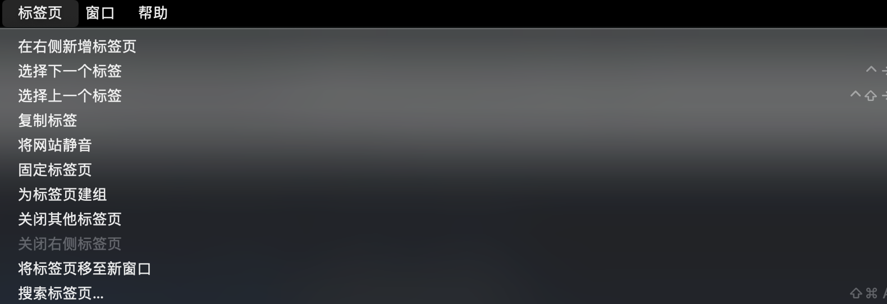

## 🤗 Generate BY Golang 🤗

### STEPS
* STEP 1. edit cmd/main.go
* STEP 2. exec cmd/main.go -> `go run cmd/main.go`


-------

### FORMARTS

```golang
template.NewMenuBuilder("Chrome", []string{"标签页", "关闭右侧标签页"}).Build()
```
🥇 First ARG is process name OR application name

🥈 Second ARG is the menu orders


SUCH AS:




------

## ⌛ Finished LIST ⌛

| 名称                                                                                                                        | 介绍                               | 类别   |
| --------------------------------------------------------------------------------------------------------------------------- | ---------------------------------- | ------ |
| [关闭其他标签页](https://github.com/o98k-ok/awesome-apple-scripts/blob/main/collection/chrome/close_other_tabs.applescript) | 快速关闭其他标签页                 | Chrome |
| [关闭右侧标签页](https://github.com/o98k-ok/awesome-apple-scripts/blob/main/collection/chrome/close_right_tabs.applescript) | 快速关闭右侧标签页                 | Chrome |
| [Chrome插件列表](https://github.com/o98k-ok/awesome-apple-scripts/blob/main/collection/chrome/extensions.applescript)       | 查看插件列表                       | Chrome |
| [打开js终端](https://github.com/o98k-ok/awesome-apple-scripts/blob/main/collection/chrome/js_console.applescript)           | 快速打开js console                 | Chrome |
| [移动窗口](https://github.com/o98k-ok/awesome-apple-scripts/blob/main/collection/chrome/move_display_1.applescript)         | 在不同的显示器快速移动窗口         | Chrome |
| [标签页查询](https://github.com/o98k-ok/awesome-apple-scripts/blob/main/collection/chrome/search_tabs.applescript)          | 查询已经打开的标签页               | Chrome |
| [运行js代码](https://github.com/o98k-ok/awesome-apple-scripts/blob/main/collection/chrome/run_js_code.sh)                   | 执行js代码，需要安装依赖chrome-cli | Chrome |